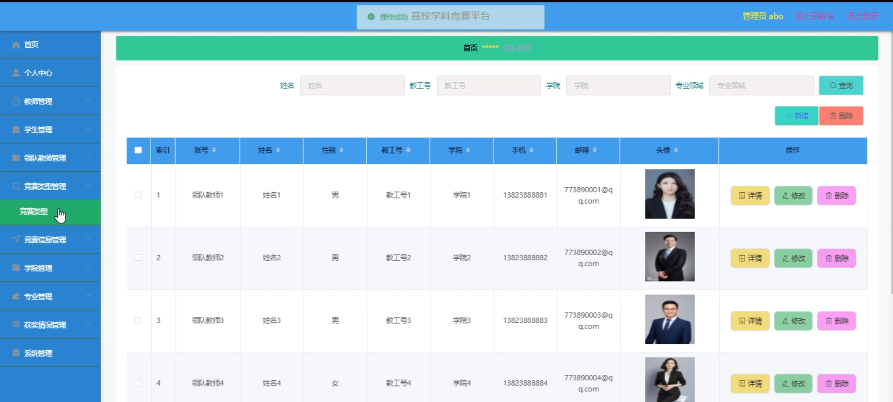

# 基于springboot的高校学科竞赛平台

---
### 👉作者QQ ：1556708905 微信：zheng0123Long (支持定制修改、部署调试、定制毕设)

### 👉接网站建设、小程序、H5、APP、各种系统等

---

#### 介绍

本竞赛管理系统是基于先进的 Spring Boot 框架开发的一体化平台，旨在为竞赛的组织、参与和管理提供全面、高效、精准的支持。通过清晰界定专业管理、学生、领队教师和教师等不同角色的权限和功能，实现了竞赛流程的规范化、信息化和智能化，有力推动了竞赛活动的顺利开展和优化提升。

#### 技术栈

后端技术栈：Springboot+Mysql+Maven

前端技术栈：Vue+Html+Css+Javascript+ElementUI

开发工具：Idea+Vscode+Navicate

#### 系统功能介绍

（一）专业管理角色功能模块  
专业管理  
对各专业的特点和优势进行详细分析，为不同专业匹配适宜的竞赛项目。  
规划专业相关的竞赛发展方向，制定长期的竞赛参与策略。  
协调专业资源在竞赛中的分配，包括师资、设备、资金等。  
获奖情况管理  
全面收集、整理和存储各专业学生在各类竞赛中的获奖记录。  
对获奖信息进行多维度分析，如按专业、年级、竞赛类型等，以评估专业教学成果和学生的专业能力提升情况。  
为学校或学院提供专业竞赛获奖情况的统计报告，作为教学质量评估和专业建设的重要参考依据。  
系统管理   
负责系统的初始化设置，包括创建用户账号、设置用户权限、定义数据字典等。  
定期进行数据备份，确保数据的安全性和完整性，同时具备数据恢复功能，以应对意外情况。  
监控系统的运行状态，包括服务器性能、数据库负载、网络流量等，及时发现并解决潜在的性能问题。  
对系统进行安全管理，如设置防火墙规则、防范网络攻击、更新系统补丁等，保障系统的稳定与安全。  
（二）学生角色功能模块  
竞赛信息  
展示各类竞赛的详细介绍，包括竞赛的主题、目的、参赛对象、时间安排、赛制流程等。  
提供竞赛的报名条件和要求，让学生清楚了解自己是否符合参赛资格。  
发布竞赛的最新通知和动态，如报名截止时间的变更、赛事规则的调整等。  
竞赛资讯  
推送最新的竞赛相关行业动态和前沿技术发展趋势，帮助学生了解竞赛领域的最新变化。  
分享成功参赛案例和经验心得，为学生提供借鉴和启发。  
介绍竞赛相关的培训课程和学习资源，辅助学生提升竞赛能力。  
个人中心  
学生可以完善和更新个人基本信息，如姓名、学号、联系方式等。  
查看自己参与过的竞赛历史记录，包括参赛时间、竞赛项目、所获成绩等。  
管理个人的学习笔记和竞赛总结，方便随时回顾和反思。  
后台管理  
竞赛题库管理  
学生能够访问部分公开的竞赛题库，进行在线学习和模拟练习。  
可以查看自己的练习记录和错题情况，针对性地进行强化训练。  
竞赛类型管理  
了解不同竞赛类型的特点、难度级别和适用范围。  
根据自己的兴趣和专业方向，选择适合的竞赛类型进行关注。  
竞赛信息管理  
收藏感兴趣的竞赛信息，方便随时查看和跟进。  
对已关注的竞赛信息设置提醒功能，避免错过重要时间节点。  
报名信息管理  
在线填写和提交竞赛报名信息，包括个人基本资料、参赛项目、团队成员等。  
查看报名审核进度，及时补充或修改报名材料。  
竞赛评分管理  
了解竞赛的评分细则和各项得分的权重分配。  
查看自己在竞赛中的各项得分和总评成绩。  
参赛名单管理  
查看已公布的参赛人员名单，确认自己和团队成员的参赛资格。  
了解同组参赛人员的基本信息，便于赛前沟通和协作。  
晋级名单管理  
实时关注竞赛的晋级情况，查看自己是否成功晋级下一轮。  
分析晋级名单，了解竞争对手的情况，为后续比赛做好准备。  
获奖名单管理  
查看最终的获奖名单，了解自己和其他团队的获奖情况。  
对获奖项目进行详细了解，学习优秀作品的经验和创新点。  
竞赛总结管理  
在线撰写竞赛总结报告，分享参赛的收获和体会。  
查看其他同学的竞赛总结  
竞赛总结管理  
在线撰写竞赛总结报告，分享参赛的收获和体会。  
查看其他同学的竞赛总结，从中汲取经验和教训。  
教师和领队可对学生的竞赛总结进行点评和指导，促进学生反思与成长。  
报销清单管理  
学生在参赛过程中产生的合规费用，可在线填写报销申请并上传相关凭证。  
查看报销申请的审批进度和结果。  
成绩申诉管理  
若对竞赛成绩存在异议，学生可以按照规定流程提交申诉材料。  
实时跟踪申诉处理进度，了解申诉结果。  
参赛信息管理  
全面管理自己的参赛信息，包括修改、补充和删除。  
对参赛信息进行分类和标注，方便查询和统计。  
往年成绩管理  
查看自己过往参与竞赛的成绩记录。  
对比分析不同年份的竞赛成绩，了解自身的进步情况。  
（三）领队教师角色功能模块  
竞赛信息  
获得更为详细和全面的竞赛信息，包括竞赛的背景、主办方的特殊要求等。  
提前了解竞赛评委的相关信息，为参赛学生提供有针对性的指导。  
竞赛资讯  
掌握行业内最新的竞赛政策和趋势，为团队参赛策略的制定提供参考。  
接收关于竞赛培训和交流活动的通知。  
个人中心  
维护个人的教学和竞赛指导履历。  
设定个性化的消息提醒方式和频率。  
后台管理    
题目类型管理  
定义和新增竞赛题目类型，以适应不同学科和专业的竞赛需求。  
对现有题目类型进行修改和完善，确保其科学性和合理性。  
删除不再适用的题目类型，保持题库的精简和有效。  
竞赛题库管理  
负责组织教师团队编写和审核竞赛题目，丰富题库资源。  
对题库中的题目进行分类和标注，便于学生有针对性地练习。  
定期更新题库内容，确保题目与最新的知识和技术同步。  
竞赛类型管理  
根据学科发展和市场需求，提议新增或调整竞赛类型。  
评估现有竞赛类型的效果和影响力，为优化竞赛体系提供建议。  
竞赛信息管理  
发布和更新竞赛的详细信息，确保学生获取到准确和及时的资讯。  
解答学生关于竞赛信息的疑问和咨询。  
参赛申请管理  
审批学生的参赛申请，综合考虑学生的学业情况、竞赛准备情况等因素。  
与申请未通过的学生进行沟通，说明原因并给予指导。  
报名信息管理  
监督学生的报名流程，确保报名信息的准确和完整。  
协调解决报名过程中出现的问题，如名额分配、报名冲突等。  
竞赛评分管理  
参与制定竞赛的评分标准和细则。  
在竞赛过程中，按照标准对学生的表现进行评分。  
参赛名单管理  
确认最终的参赛学生名单，进行人员调配和分组安排。  
关注参赛学生的赛前状态和准备情况。  
晋级名单管理  
根据竞赛成绩和规则，确定晋级学生名单。  
对晋级学生进行鼓励和进一步的指导。  
获奖名单管理  
参与评选和确定获奖学生名单。  
组织获奖学生的表彰活动。  
竞赛总结管理  
撰写团队的竞赛总结报告，总结经验教训。  
组织学生进行竞赛总结交流，促进共同提高。  
报销清单管理  
审核学生提交的报销清单，确保费用的合理性和合规性。  
与财务部门协调报销事宜，跟进报销进度。  
成绩申诉管理  
受理学生的成绩申诉，组织相关人员进行复查和核实。   
对申诉结果进行反馈和解释，确保学生的权益得到保障。  
参赛信息管理  
汇总和分析学生的参赛信息，为教学改进提供数据支持。  
跟踪学生在竞赛中的成长轨迹，为个性化培养提供依据。  
往年成绩管理  
回顾往年学生的竞赛成绩，进行纵向对比和分析。  
依据往年成绩  
依据往年成绩制定新的竞赛目标和培训计划。  
（四）指导教师角色功能模块  
竞赛指导  
为学生提供个性化的竞赛指导方案，针对学生的优势和不足制定训练计划。  
在线解答学生在竞赛准备过程中遇到的问题，提供实时的技术支持和思路启发。  
定期组织学生进行集中讨论和交流，促进团队协作和知识共享。  
资料分享
上传和分享与竞赛相关的学习资料、参考书籍、研究报告等，丰富学生的学习资源。
推荐优秀的在线课程、学术讲座和行业论坛，拓宽学生的知识视野。
整理和发布自己的教学笔记和心得体会，帮助学生更好地理解竞赛要点。
团队管理  
组建和管理竞赛团队，协调团队成员之间的分工和合作。  
关注团队成员的心理状态和学习进度，及时给予鼓励和调整建议。  
组织团队内部的模拟竞赛和评估，提高团队的实战能力。  
后台管理  
竞赛进度管理  
制定详细的竞赛准备进度表，明确各个阶段的任务和时间节点。  
实时跟踪学生的竞赛准备进度，对滞后的任务进行提醒和督促。  
根据实际情况调整进度安排，确保竞赛准备工作有序进行。  
训练计划管理  
设计科学合理的竞赛训练计划，包括理论学习、实践操作、模拟演练等环节。  
定期评估训练效果，根据学生的反馈和表现对训练计划进行优化。  
为不同水平和特点的学生制定差异化的训练计划，满足个性化需求。  
学生表现管理  
记录学生在竞赛准备过程中的表现，包括学习态度、技能掌握、创新能力等方面。  
对学生的表现进行综合评价和分析，为后续的指导和推荐提供依据。  
与表现不佳的学生进行单独沟通和辅导，帮助他们克服困难。  
题目审核管理  
审核学生自主设计或练习的竞赛题目，确保题目质量和符合竞赛要求。  
对题目中的错误和不足之处提出修改意见，引导学生提高题目设计能力。  
竞赛成果管理  
收集和整理学生在竞赛中取得的成果，如作品、论文、获奖证书等。  
对竞赛成果进行展示和推广，提升团队的知名度和影响力。  
经费申请管理  
根据竞赛需求，协助学生申请竞赛经费，并跟进审批流程。  
合理规划和使用经费，确保经费用于竞赛相关的培训、设备购置和差旅等方面。  

#### 系统功能截图

代码结构

数据库表

竞赛信息

个人中心

后台管理

报名信息管理

竞赛总结管理

往年成绩管理

领队教师端的报名信息管理

教师端首页

管理员端学生信息

竞赛类型

专业管理

获奖情况

参赛申请管理

#### 总结

本竞赛管理系统通过精细的功能模块设计，满足了不同角色在竞赛管理中的需求，实现了竞赛全过程的信息化、规范化和科学化管理。这不仅有助于提高竞赛的组织效率和质量，也为培养创新型人才提供了有力的支持和保障。

#### 使用说明

创建数据库，执行数据库脚本 修改jdbc数据库连接参数 下载安装maven依赖jar 启动idea中的springboot项目

后台地址：http://localhost:8080/springboot46869/admin/dist/index.html

管理员  abo 密码 abo

前台地址：http://localhost:8080/springboot46869/front/index.html

